# TA1 - ANÁLISE E MODELAGEM DE SISTEMAS

## Fundamentos da Engenharia de Software

| Década | Descrição |
| --- | --- |
| 50 - 60 | Sistemas operacionais   Linguagens de Programação |
| 60 - 70 | Crise do Software   Paradigmas da programação |
| 1980 | PC   Evolução da Internet |
| 1990 | Internet   Java |
| 2020 | IA   Computação em nuvem|

### Curvas de Defeitos

Como as modificações e manutenções afetam o software

### Camadas da Engenharia de Software

### Fases da Engenharia de Software

- Análise
- Projeto
- Implementação
- Testes
- Documentação
- Manutenção

## Análise de Sistemas

### Princípios

- Domínio da Informação
- Comportamento do Software
- Diagramas
- Informações e Detalhes

### Analista de Sistema

- Interagir com o Cliente
- Levantar os dados e os requisitos do software para analisar e propor soluções
- Criar a modelagem do software
- Orienta os programadores
- Acompanha e executa os testes
- Garantir a qualidade do software
- Implantar o Software desenvolvido

### Processo de software

- Criar uma padronização
- Reutilização
- Retém o conhecimento da empresa
- Guiar e definir as atividades do processo de software
- Determinar Tarefas
- Reduzir riscos

## Modelos de processos de software

Processos são entradas que passam por diversas fases, com atividades que gera um software.

### Atividades do desenvolvimento

- Especificação de software (Conhecer o sistema, definir o que vai ser desenvolvido)
- Projeto e Implementação de software (Diagramas, Modelagem)
- Validação de software (Testes)
- Evolução de software (Manutenção, adicção de funcionalidades)

### Fluxo de Processos OU Ordem:

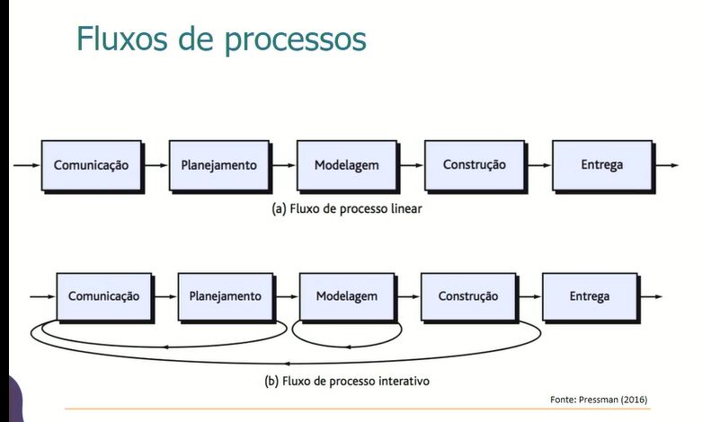

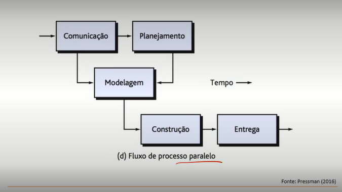

- Fase de Planejamento
    - Atividades
        - Levantar requisitos;
        - Especificação dos Requisitos;
        - Estimativas de Prazos;
        - Estimativa de Recursos;
    - Entregáveis
        - Documentações
        - Plano de ação para determinar prazos
        - Alocação de Recursos para criação do Software

- Avaliação e aperfeiçoamento de processos:
    - CMMI
    - MPS-BR
    - ISO 9001:2000

### Modelo de software

#### Modelo Cascata

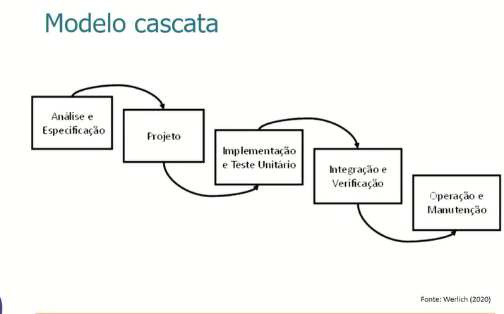

- Não é bom para projetos grandes e com mudas mudanças
- Trouxe ordem ao caos, mas é obsoleto

#### Modelo Incremental

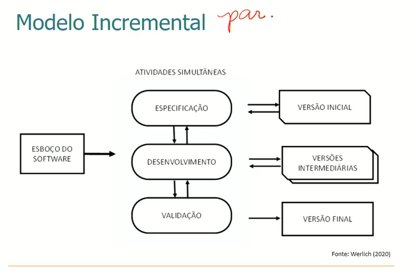

#### Modelo Espiral

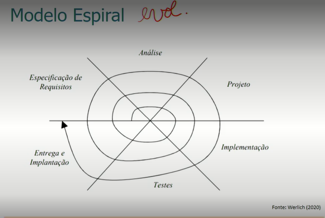

- Evolucionário.
- Pequenos ciclos.

#### Modelo de processos especializados.

- Modelo Baseado em Componentes;
- Modelo de Métodos Formais;
- Modelo de Processo Unificado (UML)
- Modelo de Processos Pessoal e de Equipe;

## Aspectos do Processo Unificado

1. Caso de Uso;
    - Busca entender o que o usuário deseja
2. Arquitetura de Software;
    - Busca uma visão abrangente do software
3. Iterativo e Incremental;

### Ciclo de vida:

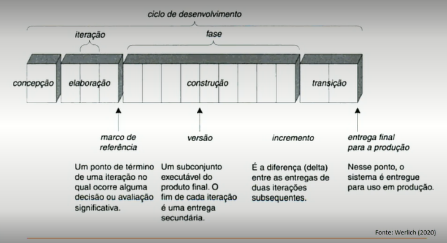

## Modelo de desenvolvimento ágil

- Motivações:
    - Menos centrada em documentação
    - São adaptativas em vez de determinantes
    - Aceitam mudança mais naturalmente
    - Orientado a pessoas e não a processos
- Princípios:
    - Envolvimento do cliente
    - Entrega incremental
    - Pessoas e não processos
    - Aceitar mudanças
    - Manter a simplicidade

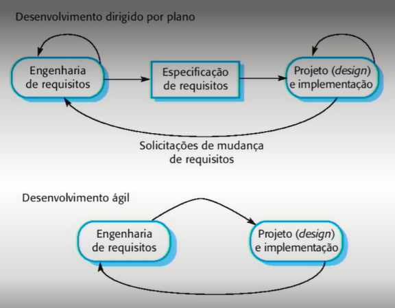

### XP (Extreme Programming)

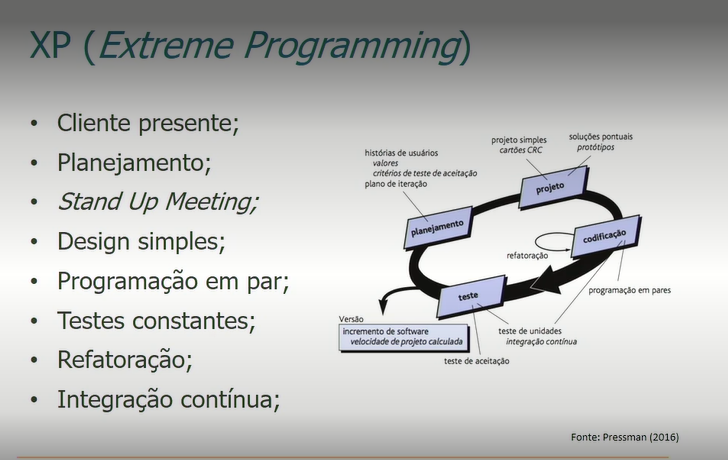

### Desenvolvimento Dirigido por Funcionalidade

- Enfatiza o uso de orientação a objetos
- Duas Fases:

    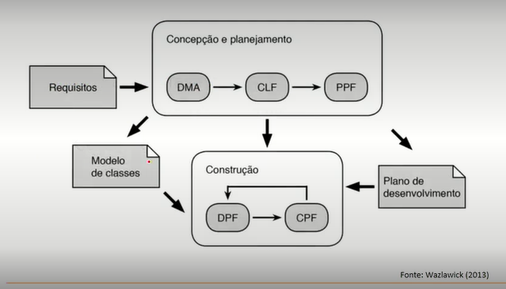

### ASD - Adaptive Software Development

- É baseado em ciclos iterativos de 4 a 8 semanas
- Os prazos são pré-fixados
- É tolerante à mudanças e á adaptação
- É orientado a desenvolver primeiramente os elementos de maior risco

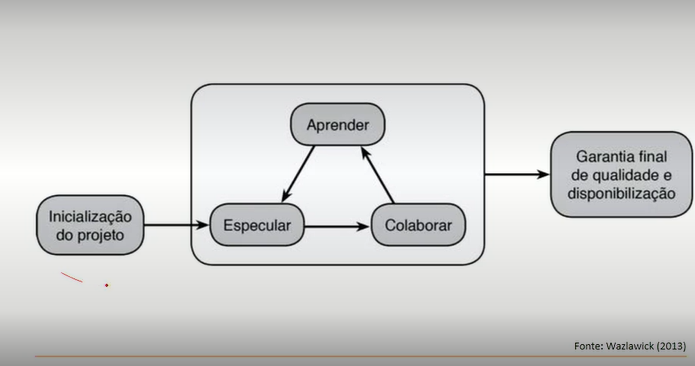

### SCRUM

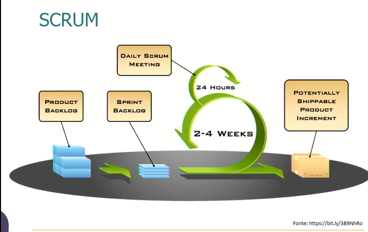

- Quadro Kanbam
