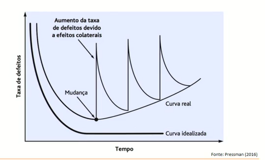
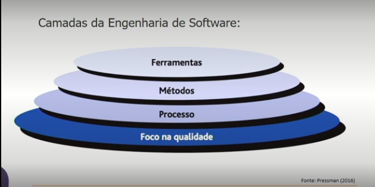
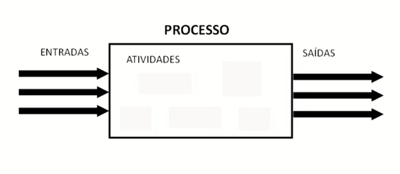
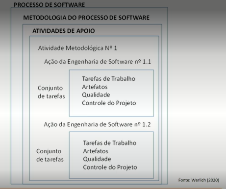

# TA1 - ANÁLISE E MODELAGEM DE SISTEMAS

## Fundamentos da Engenharia de Software

| Decada | Descrição |
| --- | --- |
| 50 - 60 | Sistemas operacionais   Linguagens de Programação |
| 60 - 70 | Crise do Software   Paradigmas da programação |
| 1980 | PC   Evolução da Internet |
| 1990 | Internet   Java |
| 2020 | IA   Computação em nuvem|

### Curvas de Defeitos

Como as modificaçoes e manutenções afetam o software

### Camadas da Engenharia de Software

### Fases da Engenharia de Software

- Análise
- Projeto
- Implementação
- Testes
- Documentação
- Manutenção

## Análise de Sistemas

### Principios

- Domínio da Informação
- Comportamento do Software
- Diagramas
- Informações e Detalhes

### Analista de Sistema

- Interagir com o Cliente
- Levantar os dados e os requisitos do software para analisar e propor soluções
- Criar a modelagem do software
- Orienta os programadores
- Acompanha e executa os testes
- Garantir a qualidade do software
- Implantar o Software desenvolvido

### Processo de software

- Criar uma padronização
- Reutilização
- Retém o conhecimento da empresa
- Guiar e definir as atividades do processo de software
- Determinar Tarefas
- Reduzir riscos

