# Fundamentos de processos de negócio

## Processo de negócio

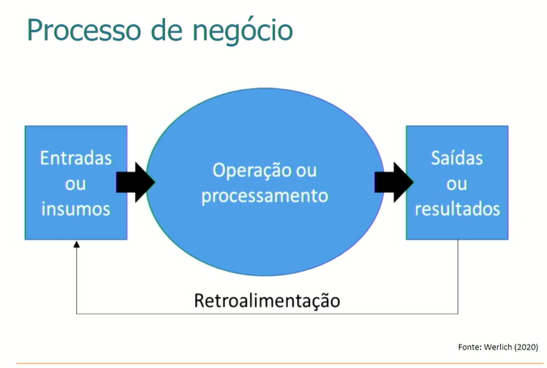

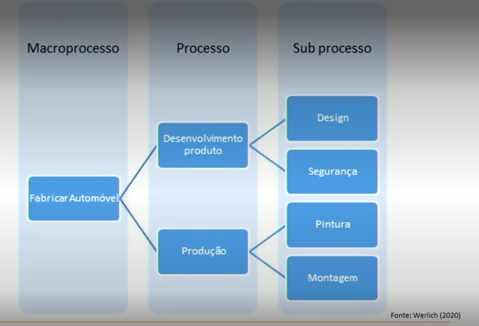

- Macroprocesso: Objetivo.
- Processos: Partes do Objetivo.
- Subprocessos: Tarefas para alcançar objetivos.

## Processos de Negócios

- Processos primários são as atividades essenciais, geram valor para o cliente.
- Processos de suporte
- Processo de gerenciamento, buscam medir a efetividade dos processos

### Benefícios do gerenciamento dos processos.

- Alinhamento dos processos com a estratégia organizacional
- Melhoria da qualidade dos processos
- Reduz complexidade dos processos, facilitando a interação entre as áreas.
- Aumento do envolvimento e comprometimento das partes interpresadas

### Motivos para modelar

- Melhorar processos
- Eliminar ou automatizar processos
- Documentar processos.

#### BPMN

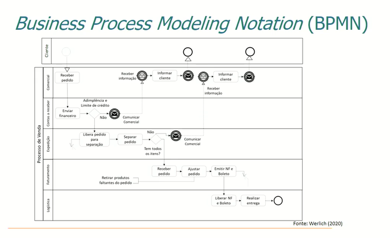

Cada simbolo tem significado próprio, veja o link [LucidChart](https://www.lucidchart.com/pages/pt/simbolos-e-notacao-de-diagramas-bpmn)

### Elementos Básicos

- Atividade: Tarefa
- Evento: Inicio, fim do BPMN
- Gateway: Decisão, "IF"
- Conector: Liga os elementos

#### Subprocessos

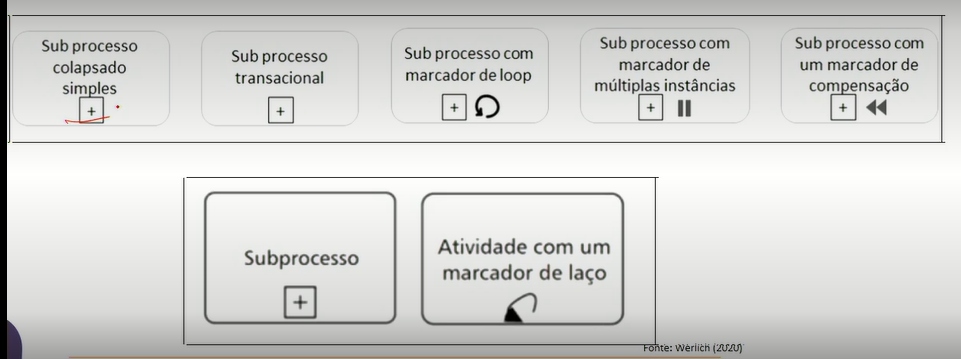

#### Eventos

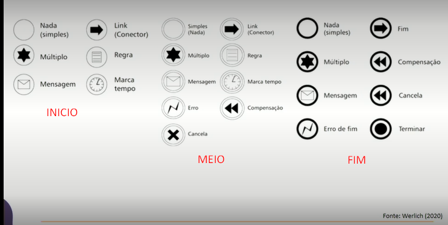

#### Gateways

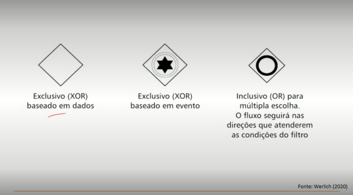

#### Conectores

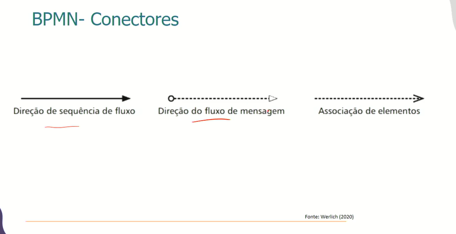

#### Outros Elementos

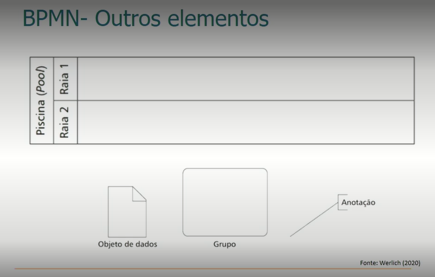

## Atividades feitas durante a Aula:

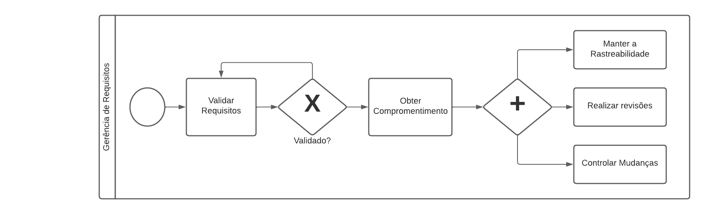

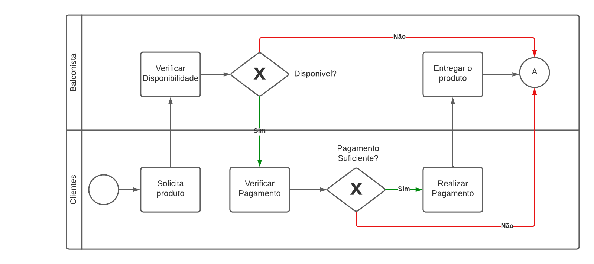

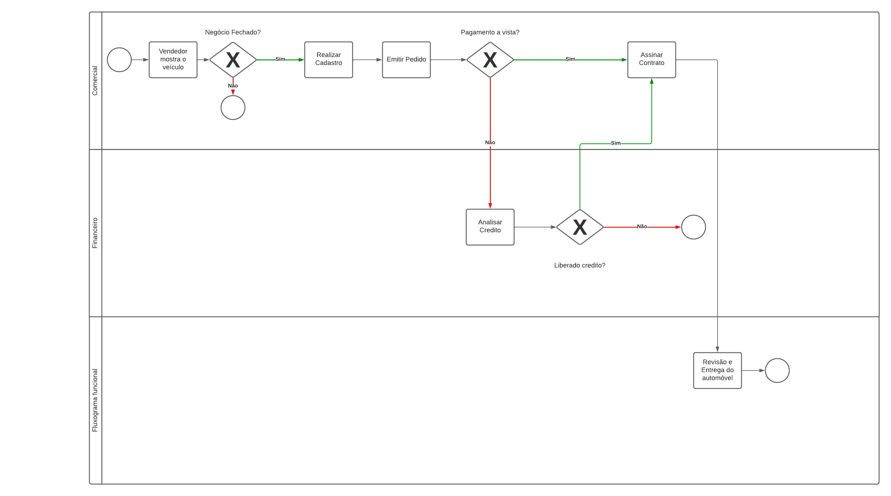

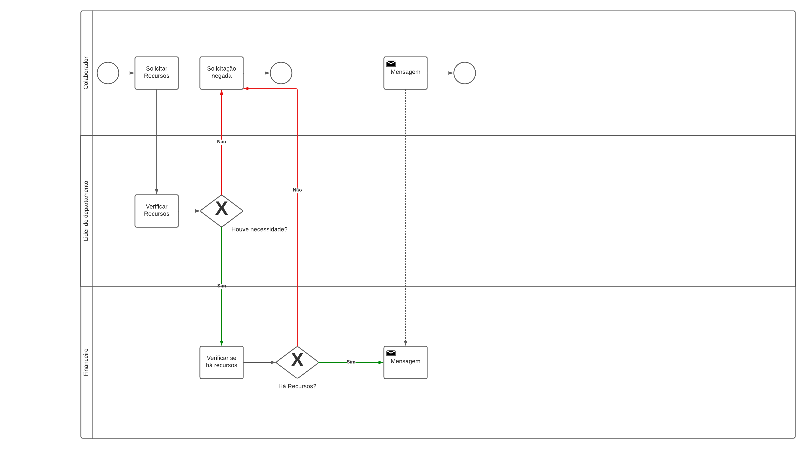
