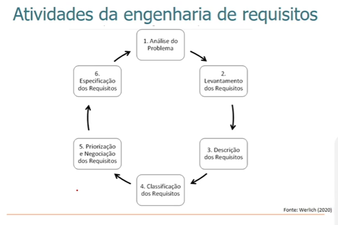
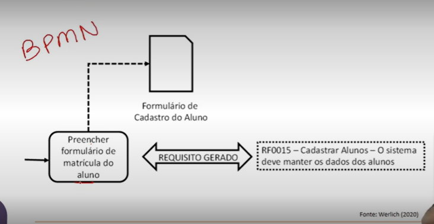
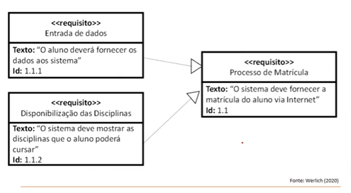
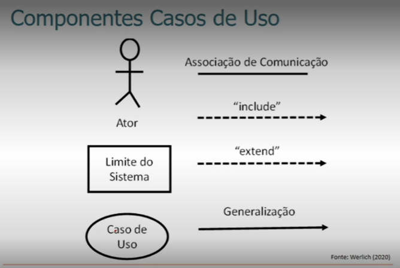
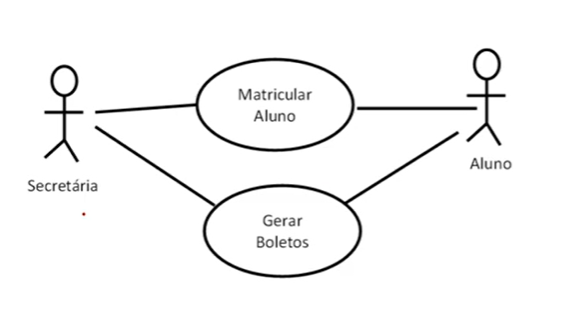
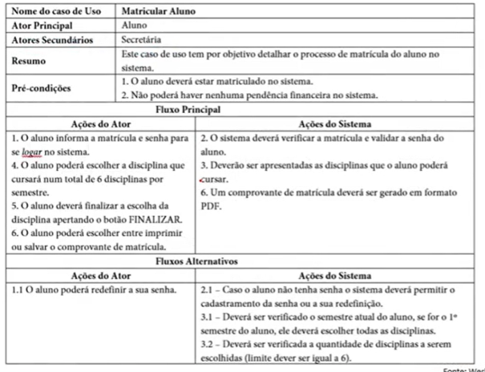

# Processo de Engenharia de Requisitos

## Requisito de sistema

- Função
- Qualidade
- Especificações dos serviços
- Restrições
- Características gerais

## Qualificação dos requisitos

- Exatidão
- Precisão
- Completude
- Consistência: Não pode conflitar com outros requisitos
- Priorização
- Verificabilidade: Saber se esse requisito é o que foi solicitado
- Modificabilidade
- Rastreabilidade: Saber qual requisito impacta em outro requisito

## Classificação dos requisitos

- Essencial
- Importante
- Desejáveis

## Tipos de requisitos

- Funcional: Funcionalidade do sistema
- Não funcionais: Estabelecem restrições sobre as funcionalidades do sistema (Geralmente relacionado com qualidade)
- Requisistos de domínio

### Requisitos Funcionais

Exemplos:

- [RF-0001] - O Sistema deve *manter* os dados pessoais e acadêmicos dos alunos.
- [RF-0002] - O Sistema deve permitir que o aluno faça a matrícula por disciplina
- [RF-0003] - O Sistema deverá manter os dados pessoais e profissionais dos professores, especialmente dos seguintes atributos: CPF, RG, Nome, endereço (completo), data de nascimento, telefones para contato, e-mail, nacionalidade, data de admissão, data de demissão, valor da hora-aula, carga horaria
- [RF-0004] - O sistema deve permitir a visualização das notas cadastradas

### Requisitos Não funcionais

- [RNF-0001] - O tempo de espera do aluno para visualizar as notas não podera exceder os 7 segundos
- [RNF-0002] - O sistema deverá ser implementado utilizando a linguagem de programação java
- [RNF-0003] - As notas só poderão ser lançadas por profissionais com perfil de professor
- [RNF-0004] - Todas as cores do sistema deverão obedecer ao padrão de cores da instituição
- [RNF-0005] - Todos os relatórios deverão ser gerados em PDF

#### Métricas de Requisitos não funcionais

- Velocidade
- Tamanho
- Usabilidade
- Confiabilidade
- Robustez
- Portabilidade

## Proecesso de elicitação dos requisitos

- Descoberta de requisitos
- Classificação e organização de requisitos
- Priorização e negociação de requisitos
- Especificação de requisitos

## Técnicas da elicitação de requisitos

- Pesquisa
- Entrevista
- Reuniões
- Documentos
- Etnografia

### Documentação da elicitação de requisitos

- Lista de funcionalidades
- Casos de uso que podem ser exemplificadas pelo UML
- Cenários de uso

### Técnicas de modelagem

- REMO
    -
    
    
    
- SysML
    -
    
     
    
- UML | É uma linguagem de modelagem para casos de uso.
    -

    Componentes Casos de Uso

    
    
    - Dentro do caso de uso devemos ter um verbo na primeira palavra.

    - **Generalização**: São heranças, pode herdaer funcionalidades
    - **Include**: Ação obrigatória após outra ação
    - **Extend**: Ação opcional após outra ação

    

    

